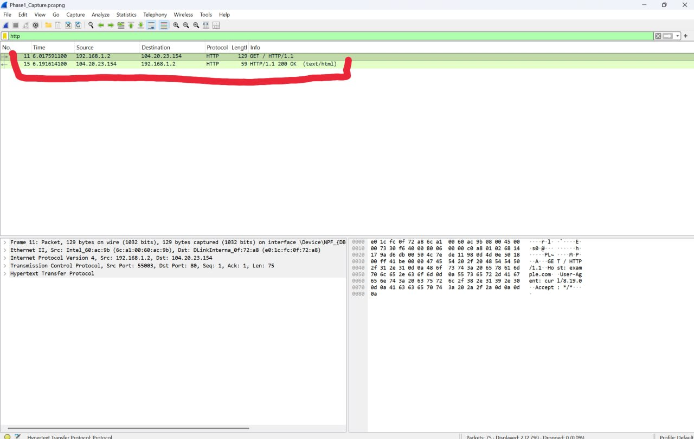
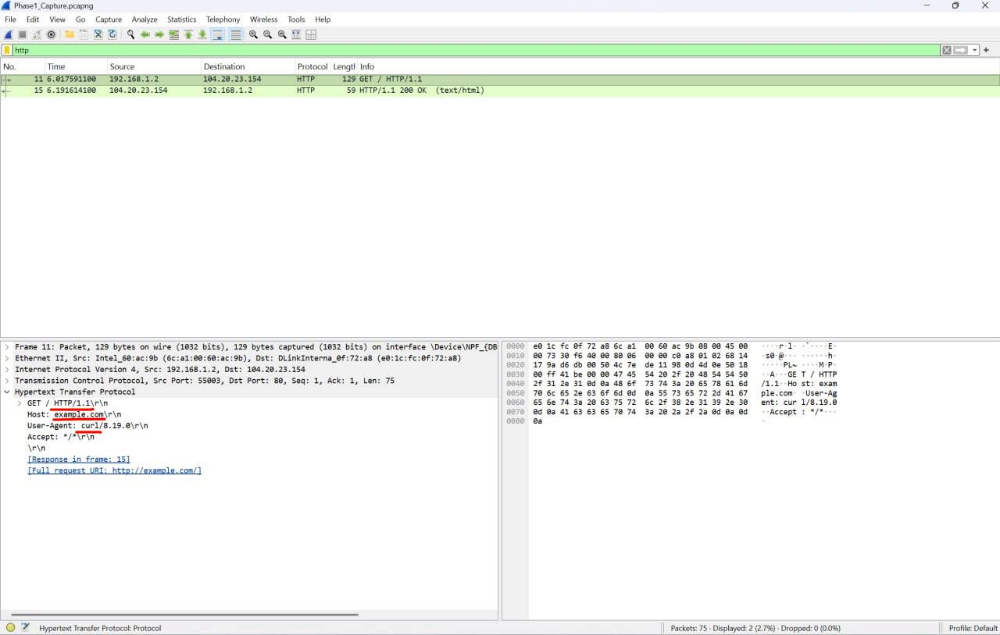
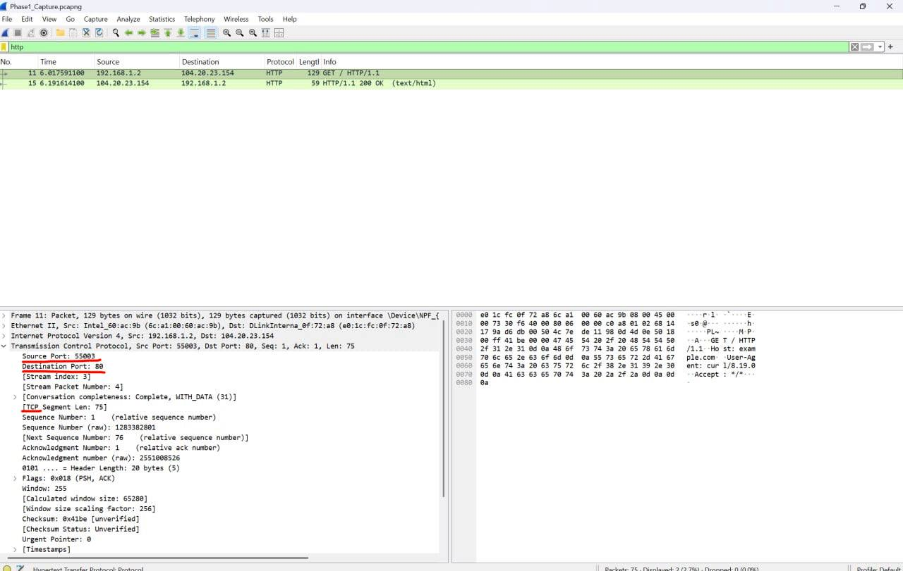
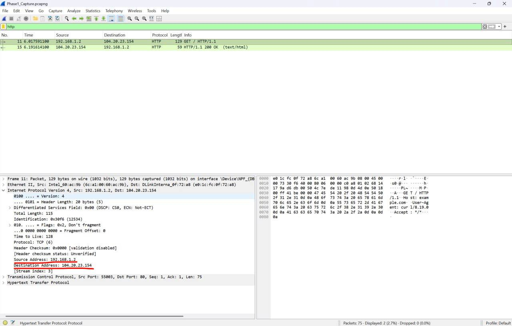
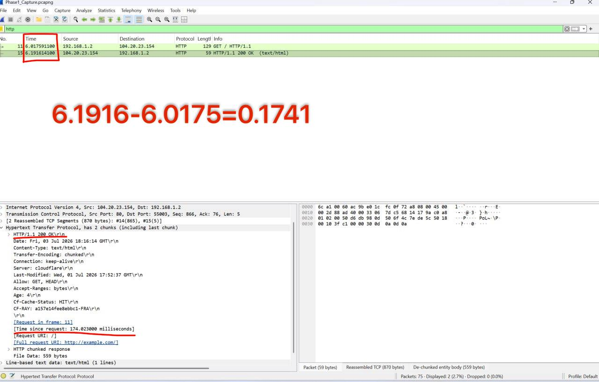
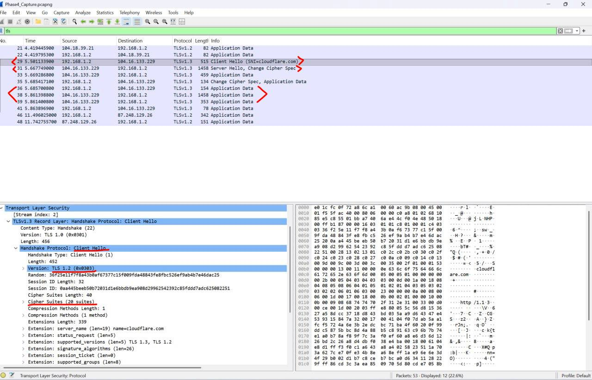
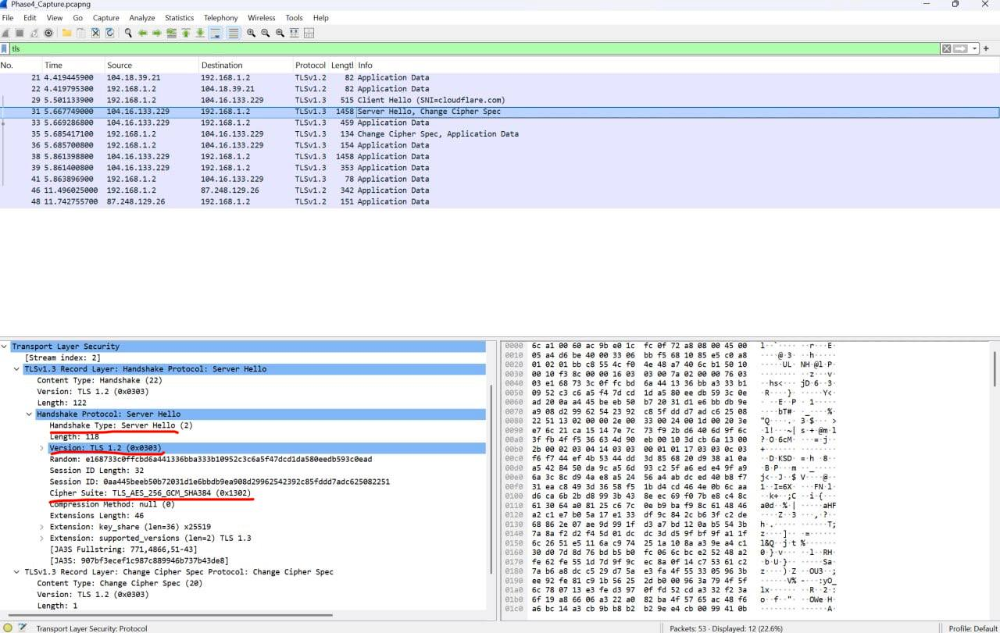
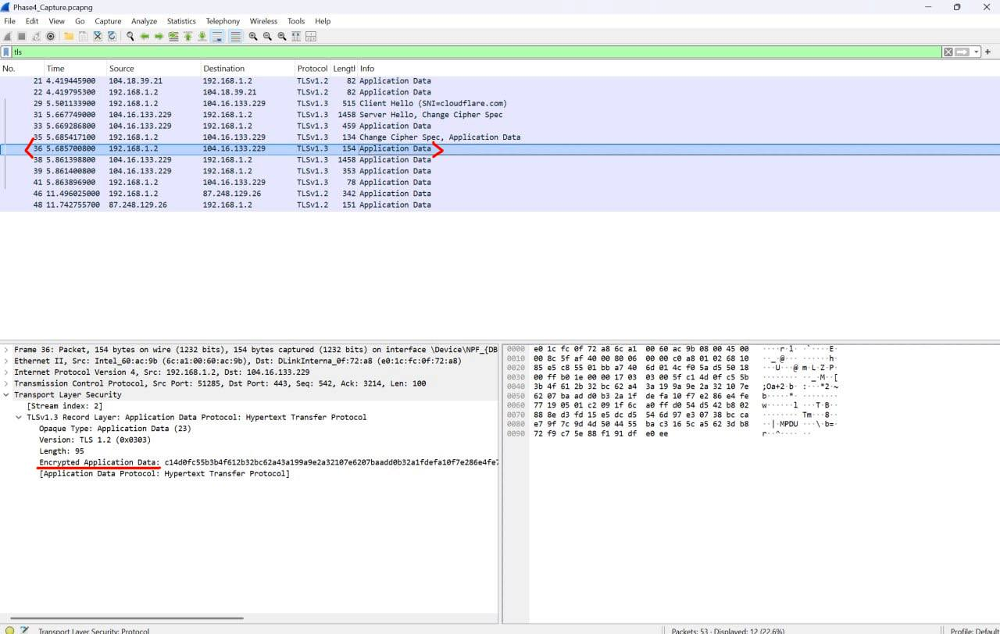
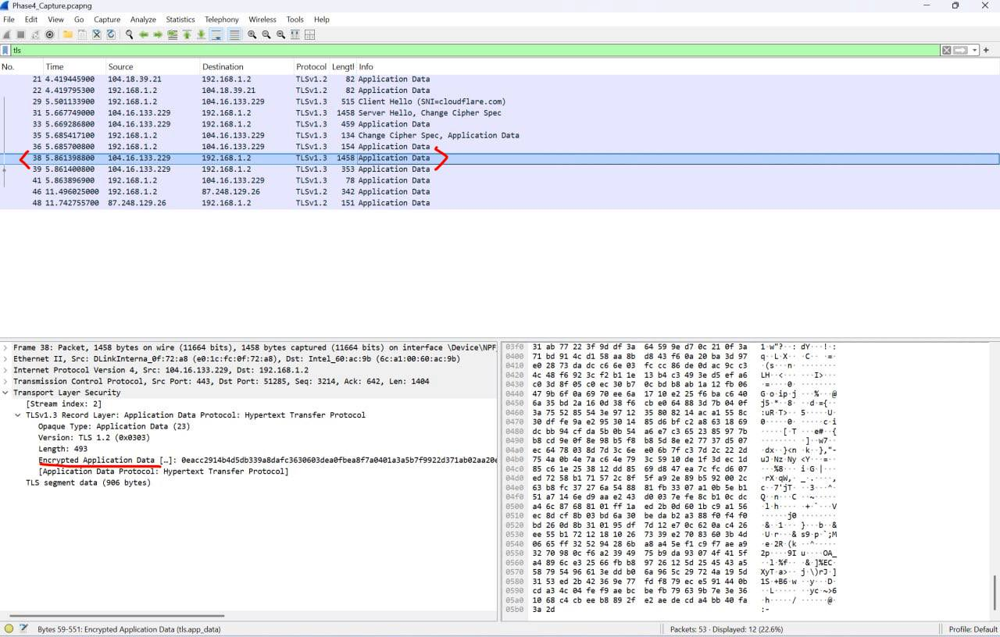

<div dir="rtl">

# پروژه پایانی درس شبکه‌های کامپیوتری

**دانشگاه کردستان — دانشکده مهندسی**  
**گروه مهندسی کامپیوتر و فناوری اطلاعات**

---

## مشخصات

| فیلد | مقدار |
|------|-------|
| نام و نام خانوادگی | جوانا روحی صفائی |
| شماره دانشجویی | 40217023137 |
| استاد درس | دکتر سعدون عزیزی |
| موضوع پروژه | تحلیل عمیق پشته پروتکلی وب (HTTP/TCP/IP) با ابزار curl و Wireshark |

---

## ابزارهای استفاده شده

| ابزار | نقش |
|-------|-----|
| Wireshark | ضبط و تحلیل ترافیک شبکه |
| curl | ارسال درخواست HTTP/HTTPS از طریق ترمینال |
| Windows | سیستم‌عامل |

---

## ساختار Repository

```
├── README.md
├── Socket_Wireshark_Project_Definition.pdf
├── captures/
│   ├── Phase1_Capture.pcapng
│   └── Phase4_Capture.pcapng
├── Phase1/
│   ├── Phase1.png
│   └── Phase1_Capture.pcapng
├── Phase2/
│   ├── Layer3_Network.png
│   ├── Layer4_Transport.png
│   └── Layer7_Application.png
├── Phase3/
│   └── Server_Response.png
└── Phase4/
    ├── Wireshark/
    │   ├── Client_Hello.png
    │   ├── Server_Hello.png
    │   ├── Encrypted_Get.png
    │   ├── Encrypted_Server_Response.png
    │   └── Phase4_Capture.pcapng
```

---

## فاز اول — راه‌اندازی محیط و ضبط پکت‌ها

Wireshark باز شده و interface کارت شبکه Wi-Fi انتخاب و فرآیند Capture آغاز شد. سپس دستور زیر در ترمینال اجرا شد:

```bash
curl http://example.com
```

پس از دریافت پاسخ از سرور، کپچر متوقف و فایل با فرمت `.pcapng` ذخیره شد.

> فایل pcap در پوشه `captures` موجود است.



---

## فاز دوم — کالبدشکافی هدرها و پشته پروتکلی

فیلتر `http` در Wireshark اعمال شد. برای یافتن پکت GET مورد نظر، به ستون Info نگاه می‌شود — پکتی که در این ستون عبارت `GET / HTTP/1.1` را نشان می‌دهد و آدرس Source آن IP سیستم خودی باشد، پکت مورد نظر است.

---

### لایه ۷ — Application (HTTP)

| فیلد | مقدار |
|------|-------|
| Method | GET |
| Host | example.com |
| HTTP Version | HTTP/1.1 |
| User-Agent | curl |



---

### لایه ۴ — Transport (TCP)

| فیلد | مقدار | توضیح |
|------|-------|-------|
| Source Port | 3695 | پورت Ephemeral — سیستم‌عامل به صورت تصادفی تخصیص داده |
| Destination Port | 80 | پورت ثابت HTTP |
| Protocol | TCP | پروتکل انتقال مطمئن و اتصال‌محور |



---

### لایه ۳ — Network (IP)

| فیلد | مقدار | توضیح |
|------|-------|-------|
| Source IP | 192.168.1.6 | آدرس IP سیستم |
| Destination IP | 188.114.98.0 | آدرس IP سرور example.com |



---

## فاز سوم — تحلیل رفتار سرور و زمان‌بندی RTT

فیلتر `http` اعمال شد و پکت پاسخ سرور از روی ستون Info شناسایی شد — پکتی که عبارت `HTTP/1.1 200 OK` را نشان می‌دهد و آدرس Source آن IP سرور باشد، پکت مورد نظر است.

**Status Code: 200 OK**  
کد ۲۰۰ نشان‌دهنده آن است که سرور درخواست GET را بدون هیچ خطایی دریافت، پردازش کرده و محتوای صفحه درخواست‌شده را با موفقیت به کلاینت بازگردانده است؛ این کد پایه‌ای‌ترین نشانه یک تراکنش HTTP موفق محسوب می‌شود.

**RTT (Round Trip Time): 148.282600 milliseconds**  
مدت زمانی که از ارسال درخواست GET تا دریافت اولین پکت پاسخ از سرور طول کشید.

### تحلیل سناریوی کندی

اگر مقدار RTT بیش از ۲ ثانیه باشد، سه دلیل اصلی می‌تواند داشته باشد:

**۱. سمت کلاینت:** منابع سیستم (CPU یا RAM) تحت فشار زیاد هستند و پردازش پکت‌ها با تأخیر انجام می‌شود.

**۲. پهنای باند شبکه:** اتصال اینترنت ضعیف یا پرترافیک است و پکت‌ها برای رسیدن به سرور زمان بیشتری نیاز دارند.

**۳. سمت سرور:** سرور زیر بار پردازشی زیاد است، درخواست‌های زیادی در صف دارد و دیر پاسخ می‌دهد.

برای تشخیص کندی سه راهکار می‌تواند مورد استفاده قرار گیرد:

**۱**. اگر درخواست GET دیر از سیستم خارج شود،مشکل ممکن است سمت کلاینت باشد.

**۲**. اگر بین پکت‌ها ACKهای تکراری، Retransmission یا تأخیرهای زیاد در TCP ببینی، احتمال مشکل شبکه یا Packet Loss وجود دارد.

**۳**. اگر درخواست سریع به سرور رسیده ولی پاسخ دیر برگشته، احتمال مشکل سمت سرور یا پردازش داخلی سرور بیشتر است.




---

## فاز چهارم — کالبدشکافی HTTPS و تحلیل TLS

دستور زیر اجرا شد:

```bash
curl https://cloudflare.com
```

فیلتر `tls` در Wireshark اعمال شد و پکت‌های زیر مشاهده شدند:

| پکت | جهت | توضیح |
|-----|-----|-------|
| Client Hello | کلاینت ← سرور | کلاینت لیست ۲۱ الگوریتم رمزنگاری پشتیبانی‌شده را برای سرور ارسال کرد |
| Server Hello | سرور ← کلاینت | سرور یک الگوریتم رمزنگاری مشترک از لیست کلاینت انتخاب کرد |
| Certificate | سرور ← کلاینت | سرور گواهی دیجیتال X.509 خود را برای اثبات هویت ارسال کرد |
| Key Exchange | هر دو طرف | پارامترهای لازم برای محاسبه کلید مشترک رمزنگاری بین دو طرف تبادل شد |
| Application Data | هر دو طرف | داده‌های HTTP به صورت کاملاً رمزشده رد و بدل شدند |

> **گواهی دیجیتال (Certificate):** یک سند الکترونیکی است که هویت سرور را تأیید می‌کند و توسط یک مرجع معتبر (CA) امضا شده است.  
> **Key Exchange:** فرآیندی که طی آن کلاینت و سرور بدون ارسال مستقیم کلید، یک کلید مشترک مخفی محاسبه می‌کنند.

### اطلاعات Client Hello

| فیلد | مقدار |
|------|-------|
| Handshake Type | Client Hello (1) |
| TLS Version | TLS 1.2 (0x0303) |
| Cipher Suites | 21 الگوریتم پیشنهادی |



### اطلاعات Server Hello

| فیلد | مقدار |
|------|-------|
| TLS Version | TLS 1.2 |
| Cipher Suite انتخاب‌شده | TLS_ECDHE_ECDSA_WITH_AES_128_GCM_SHA256 |



### Application Data — داده‌های رمزشده

| پکت | جهت | توضیح |
|-----|-----|-------|
| Encrypted GET | کلاینت ← سرور | درخواست HTTP رمزشده معادل GET |
| Encrypted Server Response | سرور ← کلاینت | پاسخ HTTP رمزشده معادل 200 OK |




### چرا محتوای HTTP در HTTPS قابل مشاهده نیست؟

در پروتکل HTTP ساده، تمام داده‌ها به صورت Plain Text روی شبکه منتقل می‌شوند و هر ابزاری مانند Wireshark می‌تواند محتوای کامل درخواست و پاسخ را بخواند. اما در HTTPS، پیش از انتقال هر داده‌ای، یک فرآیند TLS Handshake انجام می‌شود که طی آن کلاینت و سرور بدون ارسال مستقیم کلید، یک کلید مشترک مخفی با استفاده از الگوریتم ECDHE محاسبه می‌کنند. از این لحظه به بعد، تمام داده‌های HTTP — شامل هدرها، متد GET، کد وضعیت و محتوای صفحه — با الگوریتم AES-128-GCM رمزنگاری می‌شوند. Wireshark پکت‌های Application Data را می‌بیند اما چون کلید رمزگشایی را ندارد، تنها یک رشته Hex ناخوانا نمایش می‌دهد. این دقیقاً دلیلی است که در فازهای اول تا سوم این پروژه از `http://` استفاده شد تا امکان تحلیل کامل لایه‌های پروتکلی وجود داشته باشد.


---

## پیوست‌ها

- فایل کپچر فاز اول: [`captures/Phase1_Capture.pcapng`](captures/Phase1_Capture.pcapng)
- فایل کپچر فاز چهارم: [`captures/Phase4_Capture.pcapng`](captures/Phase4_Capture.pcapng)

</div>
